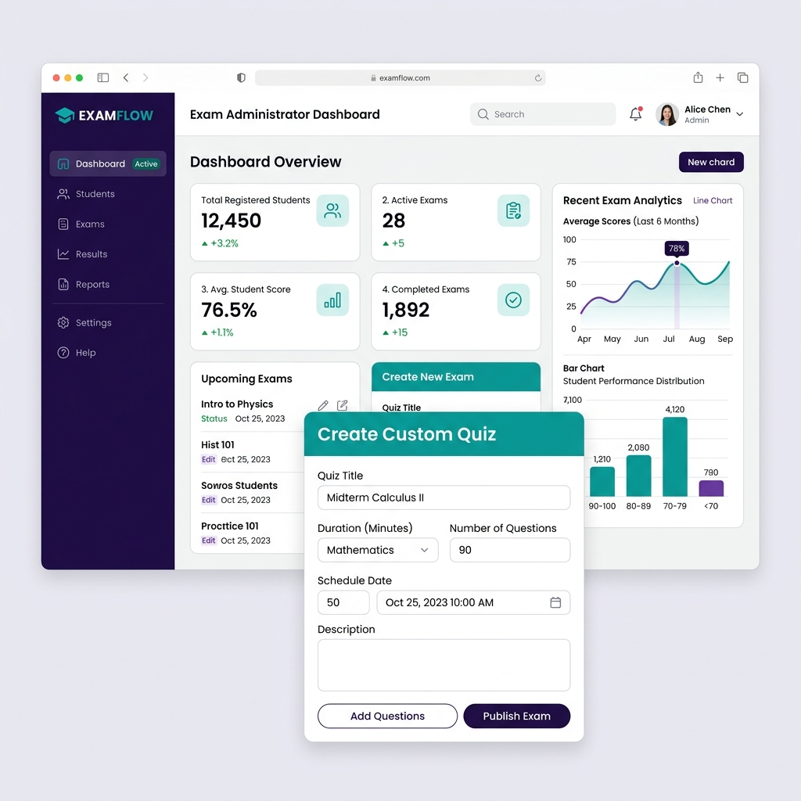

# 🎓 Test Your Skill — Online Examination System

Welcome to the **Online Examination System**, a flexible, feature-rich testing platform designed for students and administrators. The application now supports **dual runtime modes** — you can run it as a server-side dynamic PHP/MySQL application or deploy it instantly as a serverless static client-side web application on GitHub Pages!


---

## ⚡ Key Highlights
* **Dual Runtime Modes**: Supports both a dynamic PHP/MySQL backend and a static client-side database module powered by `localStorage`.
* **Instant GitHub Pages Deployment**: Fully compatible with static web hosting out-of-the-box.
* **Interactive Live Exams**: Timed examinations with progress indicators, instant scoring, and correct-answer feedback.
* **Leaderboards & History**: Live ranking scoreboard and personal user exam histories.

---

## 📐 Application Architecture & Views

### 1. Student Dashboard
Allows users to register, sign in, search quizzes by tags, answer multiple-choice questions within a time limit, and view their exam history and ranking on the global leaderboard.


### 2. Admin Dashboard
Empowers admins to manage active users, read/archive student feedbacks, delete users, list quizzes, and design new quizzes with custom question fields.



---

## ⚙️ How to Run

Select your preferred deployment option:

### Option A: Serverless Static Mode (GitHub Pages / Client-Side)
No backend server or SQL installation required. The database is simulated locally in browser memory (`localStorage`).

1. **Local Run**: Double-click [index.html](index.html) to open the dashboard immediately in any web browser.
2. **GitHub Pages Deployment**:
   - Push the code to your repository.
   - Go to **Settings** -> **Pages** in GitHub.
   - Select the `main` branch and `/ (root)` folder, then click **Save**.
   - Your site will go live at `https://<your-username>.github.io/<repo-name>/`.

#### 🔑 Pre-seeded Admin Credentials (Static Mode)
* **Email**: `vijaymahes9080@gmail.com`
* **Password**: `123456`

---

### Option B: Server-Side Dynamic Mode (PHP & MySQL)
A fully relational database-backed stack.

#### Prerequisites
* **Web Server Stack**: XAMPP, WAMP, MAMP, or LAMP server.
* **PHP**: 7.x or higher
* **Database**: MySQL / MariaDB

#### Setup Steps
1. Copy the project folder into your server directory (e.g., `C:/xampp/htdocs/` or `/var/www/html/`).
2. Open **phpMyAdmin** and create a new database named `quiz_new`.
3. Import the [project.sql](project.sql) file into the newly created database.
4. Open [dbConnection.php](dbConnection.php) and verify your MySQL connection settings:
   ```php
   $con = new mysqli('localhost', 'root', 'password', 'quiz_new') or die("Could not connect to mysql");
   ```
5. Open your browser and navigate to `http://localhost/online-examination-systen-in-php/index.php`.
6. To log in to the admin dashboard, open `http://localhost/online-examination-systen-in-php/index.php`, click **Admin Login** in the footer, and enter the credentials.

#### 🔑 Default Admin Credentials (PHP Mode)
* **Email**: `vijaymahes9080@gmail.com`
* **Password**: `123456`
*(Secondary Admin Email: `admin@admin.com` | Password: `admin`)*

---

## 📋 Feature Matrices

| Feature Area | PHP/MySQL Dynamic Mode | Static HTML/JS LocalStorage Mode |
| :--- | :---: | :---: |
| **User Sign Up / Log In** | Server validated (MD5 hashed in MySQL) | Browser validated (MD5 hashed in `localStorage`) |
| **Exam State Persistence** | Shared server-side database | Local browser cache (isolated per visitor) |
| **Countdown Timer** | Active dynamic timeout checks | Local JS interval timer with auto-submit |
| **Leaderboard Leader Rankings** | Aggregated from all server accounts | Local browser user histories rank list |
| **Admin Quiz Builder** | Database writes (`insert into quiz/questions`) | Appends items to local JSON database |

---

## 🛠️ Built With
- **Frontend**: HTML5, CSS3, JavaScript, jQuery, Bootstrap 3.x
- **Backend (PHP Mode)**: PHP 7, MySQLi
- **Storage (Static Mode)**: LocalStorage & SessionStorage Web APIs
- **Design Mockups**: AI Generated User Interface Mockups

---

## 📄 License
This project is licensed under the MIT License - see the [LICENSE](LICENSE) file for details.
